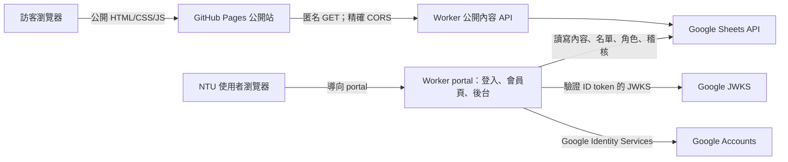
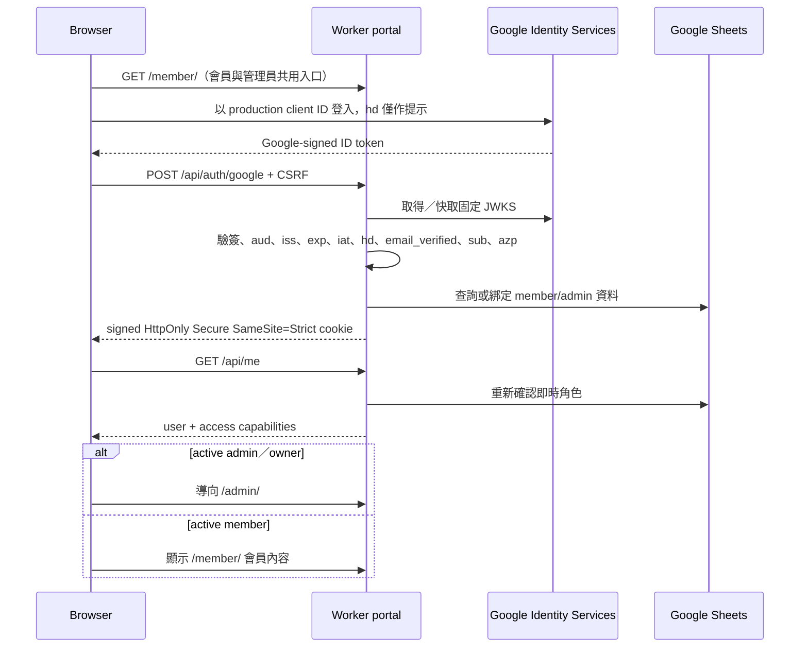

# 網站後台架構

## 目標

此架構在不大幅更動既有公開頁面視覺的前提下，加入：

- `g.ntu.edu.tw` Google 登入。
- 獨立會員名單；NTU 身分不等於系學會會員。
- 會員專屬頁面。
- 管理員後台與內容更新。
- Google Sheets 作為初期內容、名單與角色資料來源。
- 可獨立驗證的 staging 環境。

公開網站仍由 GitHub Pages 提供。登入頁、會員頁、管理後台與所有私有 API 作為一個同源 Cloudflare Worker portal 部署。這個分界保留現有公開網站，又避免 `github.io` 與 `workers.dev` 之間的第三方 session cookie。

## 系統拓撲



### 信任邊界

- 公開 HTML、前端 JavaScript、query string、request body、Google GIS 的 `hd` UI hint 均不可信。
- 只有 Worker 完成 Google token 簽章與 claims 驗證後，才能相信 `sub`、`email`、`email_verified` 與 `hd`。
- Google `hd=g.ntu.edu.tw` 只證明 NTU Workspace 身分。
- `member` 與 `admin` 權限只來自 Worker 讀取的名單／角色資料，不能來自前端或 Google email suffix。
- Google Sheet 是初期後端資料來源，不可公開分享；瀏覽器不直接持有 service-account credential。

## 元件責任

### GitHub Pages 公開站

保留目前的 HTML、CSS、圖片與導覽結構。只做必要的小幅整合：

- 加入單一「會員登入」連結，導向 Worker portal；會員與管理員不使用不同登入頁。
- 公告、連結等需要後台更新的區塊，逐步改由 Worker 公開唯讀 API 載入。
- 公開 API 失敗時可顯示 repository 內的靜態 fallback，確保公開站仍可閱讀。
- 不在 GitHub Pages 儲存 session token、Google credential 或 service-account credential。

### Cloudflare Worker portal

同一 origin 提供：

- `/member/` 單一登入 UI；登入後依即時角色顯示會員頁或導向後台。
- 會員頁及管理後台的靜態資產。
- `/api/auth/*`、`/api/member/*`、`/api/admin/*` 私有端點。
- `/api/public/*` 匿名唯讀端點。
- Google ID token 驗證、signed session cookie、CSRF、role enforcement。
- Google Sheets API adapter、欄位驗證與 audit log。

會員／管理員頁面不能只靠前端隱藏。私有資料必須由通過 Worker 驗證的 API 才能取得；若 private HTML 本身含敏感資料，也必須先經 Worker authorization。

### Google Identity Services

只負責登入當下證明 Google 帳號身分。Worker 驗證簽章、issuer、audience、時間、`hd` 與 email verification 後，才建立本站 session。Google 登入狀態與本站 session 相互獨立；本站登出必須清除自己的 cookie。

### Google Sheets

初期提供容易交接的內容管理與名單維護。所有 Sheets API 呼叫集中在 Worker，不散落於 route handler。adapter 應負責：

- 固定 sheet／column allowlist。
- 資料型別、長度、日期與 URL 驗證。
- 使用 `RAW` value input，避免公式注入。
- 將外部 API failure 轉為一致的應用錯誤。
- 對公開 read 建立短期 cache；私有及權限資料不可用不受控的公開 cache。
- 管理寫入成功後使相關公開 cache 失效或自然使用很短 TTL。

## 身分與角色

角色不是互斥單一字串，而是依身分與名單計算出的能力：

| 身分 | 公開資料 | NTU 基本頁 | 會員頁 | 更新內容 | 管理會員／admin |
| --- | --- | --- | --- | --- | --- |
| 訪客 | 讀 | 否 | 否 | 否 | 否 |
| 已驗證 NTU | 讀 | 讀 | 否 | 否 | 否 |
| active member | 讀 | 讀 | 讀 | 否 | 否 |
| admin | 讀 | 讀 | 讀 | 是 | 依 `permissions` |
| owner | 讀 | 讀 | 讀 | 是 | 是 |

`member` 與 `admin` 的資料來源分開；兩者都必須是已驗證的 NTU 帳號。現行能力計算讓 active admin 同時取得會員頁權限。owner 由受信任的 `OWNER_SUBS` 環境設定提供，擁有 `all` permission；管理 UI 不直接修改 owner 設定。

### email 到 `sub` 的初次綁定

1. 匯入名單時只有完整 email。
2. 使用者完成 Google token 驗證後，Worker 取得可信的 `sub` 與 verified email。
3. 若 active member row 尚無 `sub`，Worker 在完成驗證後寫入該 `sub`。
4. 若該 row 已綁定相同 `sub`，正常登入。
5. 若已綁定不同 `sub`，拒絕自動覆寫並要求 owner 人工處理。
6. 綁定後權限以 `sub` 為主；email 只作顯示與聯絡資料，因 email 可能變更。

admin 應盡早直接保存 `sub`。初始 owner 可暫以 `OWNER_ADMINS` 的完整 verified email bootstrap；取得 Google `sub` 後應改放 `OWNER_SUBS` 並移除 email 設定，不可因 email domain 自動授權。

## Sheet 資料模型

以下為建議欄位；所有 ID 由 Worker 建立，不使用可變標題當主鍵。

### `Settings`

| 欄位 | 說明 |
| --- | --- |
| `key` | 唯一內容鍵，例如首頁設定 |
| `value` | 文字或 JSON 字串 |
| `updatedAt` | ISO 8601 UTC |
| `updatedBy` | 操作者 verified email |

### `Announcements`

| 欄位 | 說明 |
| --- | --- |
| `id` | 不可變 UUID |
| `date` | 顯示日期 |
| `title` | 純文字標題 |
| `link` | 空值或通過 allowlist 的 HTTP(S)／站內 URL |
| `body` | 純文字內容 |
| `tag` | 固定類別 allowlist |
| `highlight` | boolean |
| `published` | boolean |
| `publishFrom`、`publishUntil` | 可選顯示區間 |
| `order` | 整數排序 |
| `updatedAt`、`updatedBy` | 更新時間與操作者 verified email |

### `Links`

| 欄位 | 說明 |
| --- | --- |
| `id` | 不可變 UUID |
| `group` | 顯示群組 |
| `title` | 顯示文字 |
| `description` | 純文字說明 |
| `url` | 通過驗證的 HTTP(S)／站內 URL |
| `icon` | 前端支援的 icon allowlist |
| `order` | 整數排序 |
| `showOnHome`、`published` | boolean |
| `updatedAt`、`updatedBy` | 更新時間與操作者 verified email |

### `MemberContent`

| 欄位 | 說明 |
| --- | --- |
| `id` | 不可變 UUID |
| `title`、`summary`、`body` | 會員內容的純文字欄位 |
| `link` | 可選安全 URL |
| `order`、`published` | 排序與發布狀態 |
| `publishFrom`、`publishUntil` | 可選發布區間 |
| `updatedAt`、`updatedBy` | 更新時間與操作者 verified email |

### `PageContent`

| 欄位 | 說明 |
| --- | --- |
| `id` | 固定為 `page-<slug>` |
| `slug` | `about`、`review`、`support` allowlist |
| `fields` | 固定欄位鍵對純文字值的 JSON；公開端只套用程式內 selector allowlist |
| `galleries` | 相簿鍵對安全圖片 URL／圖說／攝影資訊的 JSON |
| `blocks` | 自由版面區塊 JSON；類型、背景、寬度、圖片、連結及巢狀卡片皆由 Worker allowlist 驗證 |
| `published` | 是否套用後台版本；停用時公開頁沿用靜態 fallback |
| `updatedAt`、`updatedBy` | 更新時間與操作者 verified email |

### `Users`

| 欄位 | 說明 |
| --- | --- |
| `id` | Google `sub`，唯一主鍵 |
| `email` | 最近一次登入的 verified email |
| `name` | 最近一次登入的顯示名稱 |
| `lastLoginAt` | 最近登入時間 |

### `Members`

| 欄位 | 說明 |
| --- | --- |
| `id` | Worker 建立的不變 ID |
| `sub` | 首次驗證後綁定的 Google `sub`；不可由一般使用者修改 |
| `email` | 小寫正規化的完整初始名單 email |
| `name`、`studentId`、`notes` | 可選管理欄位 |
| `status` | `active`、`inactive` |
| `validUntil` | 可選期限 |
| `updatedAt`、`updatedBy` | 更新時間與修改者 verified email |

### `Admins`

| 欄位 | 說明 |
| --- | --- |
| `id` | Worker 建立的不變 ID |
| `sub` | 綁定的 Google `sub` |
| `email` | 稽核與顯示，不作最終授權鍵 |
| `name` | 顯示名稱 |
| `permissions` | 逗號分隔的固定 permission allowlist，owner 為 `all` |
| `active` | boolean |
| `updatedAt`、`updatedBy` | 更新時間與修改者 verified email |

### `AuditLog`

| 欄位 | 說明 |
| --- | --- |
| `time` | ISO 8601 UTC |
| `actor` | 操作者 verified email |
| `action` | allowlist，例如 `announcement.update` |
| `target` | 資源 ID／標題或必要 email 摘要；不含 credential、cookie 或私鑰 |

`AuditLog` 只能由 Worker append；一般 admin UI 不提供修改或刪除既有 log 的功能。

## API 邊界

### 公開 API

- `GET /api/public/home`
- `GET /api/public/links`
- `GET /api/public/page?slug=about|review|support`

只輸出 `published` 欄位，使用明確 response schema。可提供短期 public cache，並只對 `PUBLIC_SITE_ORIGINS` 中的精確 origin 回 CORS header。

### 登入 API

- `GET /api/auth/config`
- `POST /api/auth/google`
- `POST /api/auth/logout`
- `GET /api/me`

另有 `GET /api/health` 只回報各項必要設定是否存在，不輸出任何 secret 值。

`/api/me` 成功時回傳：

```json
{
  "ok": true,
  "profile": {
    "email": "student@g.ntu.edu.tw",
    "name": "Student",
    "roles": ["ntu", "member"],
    "member": true,
    "admin": false,
    "owner": false,
    "permissions": []
  }
}
```

前端只用此回應調整導覽；Worker 仍在每一個受保護 route 重做 authorization。

### 會員與管理 API

- `GET /api/member/content`：要求 verified NTU session 與 active member。
- `POST /api/admin`：要求 active admin／owner；所有 action 都要求 CSRF／same-origin 檢查，寫入另套用欄位 allowlist 與 audit log。
- admin 清單修改只允許 owner。

管理端以 `{ "action": "...", "args": {} }` 呼叫單一 `/api/admin` endpoint；批次會員匯入使用 `{ "args": { "rows": [] } }`。Worker 只接受程式內固定 action allowlist，並逐項檢查 permission 與參數；瀏覽器永遠不能指定任意 spreadsheet ID、sheet 名稱、range 或 Google API URL。

## 登入流程



登入失敗不應回傳原始 token 或底層 Google error。可使用穩定錯誤碼，例如 `invalid_google_token`、`wrong_google_domain`、`google_keys_unavailable`，但不要洩漏名單中是否存在任意 email。

## Signed HttpOnly session

session cookie 建議為版本化 HMAC token：

```text
<base64url({ v: 1, sub, iat, exp })>.<base64url(HMAC-SHA-256(payload))>
```

驗證順序：

1. 限制 cookie 長度並檢查兩段格式。
2. 以 `SESSION_SECRET` 重新計算 HMAC，使用 timing-safe comparison。
3. 簽章成功後才解析 payload。
4. 驗證版本、`sub`、`iat`、`exp`。
5. 從 `Members`／`Admins` 即時取得能力，不信任 cookie 內的 role。

cookie 只簽章、不加密，因此 payload 不放 email、name、member flag、admin flag 或任何 secret。目前正式預設 TTL 為 1 小時，實作上限為 8 小時；敏感管理操作仍可要求更短的登入年齡。logout 會清除瀏覽器 cookie，但無狀態 signed cookie 無法單獨 server-side revoke，因此短 TTL 與每次重新查權限不可省略。若未來需要立即撤銷整個登入，可再加入 session store 或 user-level `auth_epoch`。

## 後台寫入流程

1. Worker 驗證 signed session。
2. 以 `sub` 重新查 active admin／owner。
3. 驗證 `Origin`／CSRF、HTTP method、content type、body 大小及欄位 allowlist。
4. 重新讀取現有 row，再依固定欄位 schema 更新。
5. 使用 Sheets API 寫入 `RAW` 值。
6. append audit log。
7. 使對應公開 cache 失效或等待很短 TTL。
8. 回傳 canonical resource，不直接回傳 Sheets API 原始 response。

若資料寫入成功但 audit log 失敗，應記錄高優先級錯誤；Google Sheets 不提供一般資料庫等級的跨工作表 transaction，因此重要操作需設計成可重試且有唯一 operation ID。

## Cache、CORS 與錯誤處理

- `/api/public/*`：短 TTL public cache；回 `Vary: Origin`。
- `/api/auth/*`、`/api/me`、`/api/member/*`、`/api/admin`：`Cache-Control: private, no-store`。
- 私有 API 不開跨站 CORS。
- GitHub Pages 的公開讀取只允許 `PUBLIC_SITE_ORIGINS` 內的精確 origin，不反射任意 Origin。
- Google JWKS 依 Google response cache directives 快取；未知 `kid` 可刷新一次。
- JWKS／Sheets 暫時不可用時回 503 類型的暫時錯誤，不將上游故障錯判成使用者憑證錯誤。
- logs 僅記錄穩定錯誤碼、route 與狀態；不記錄 Google credential、session cookie、CSRF token、service-account key 或完整會員名單。

## Staging 與發布

建議維持兩個隔離環境：

| 項目 | Staging | Production |
| --- | --- | --- |
| Worker | staging 專用名稱／domain | 正式名稱／domain |
| OAuth client | staging client ID | production client ID |
| Authorized origins | staging + 明確 localhost | 僅 production |
| Session secret | staging 專用 | production 專用 |
| Google Sheet | 測試資料 | 正式資料 |
| 初始 owner | 測試維護者 | 正式交接名單 |

發布順序：

1. 執行 claims、session、role 與 API tests。
2. 部署 staging Worker。
3. 完成非 NTU、NTU 非會員、member、admin、撤權等瀏覽器測試。
4. 確認 staging bundle、logs 與 Git history 無 secrets。
5. 部署 production Worker。
6. 最後才在 GitHub Pages 加上正式 portal 連結與公開 API endpoint。

Production 不應接受 staging client ID；兩個環境也不應共享 session secret。若使用 Worker preview URL，不能將 wildcard preview origins 加入 OAuth allowlist，應使用固定 staging domain。

## 限制與後續演進

Google Sheets 適合低流量、低併發且需要非工程人員直接查看的初期後台，但不是關聯式資料庫：

- 權限查詢 latency 與 API quota 會限制規模。
- 多人同時編輯與跨工作表一致性較弱。
- audit log 不是不可竄改的安全事件儲存。
- 大量圖片不應放進 Sheet；只保存受控的外部 URL，未來可改用 R2。

當會員、後台操作者或內容量上升時，可將 users、roles、sessions、audit log 移到 Cloudflare D1，Google Sheets 保留為內容編輯介面或匯入來源。API schema 與前端不必因此重寫。

## 官方參考

- [Google：Verify the Google ID token on your server side](https://developers.google.com/identity/gsi/web/guides/verify-google-id-token)
- [Google：OpenID Connect claims](https://developers.google.com/identity/openid-connect/reference)
- [Google：GIS integration considerations](https://developers.google.com/identity/gsi/web/guides/integrate)
- [Cloudflare：Workers Static Assets](https://developers.cloudflare.com/workers/static-assets/)
- [Cloudflare：Web Crypto](https://developers.cloudflare.com/workers/runtime-apis/web-crypto/)
- [Cloudflare：Secrets](https://developers.cloudflare.com/workers/configuration/secrets/)
- [Cloudflare：Workers testing](https://developers.cloudflare.com/workers/testing/)
